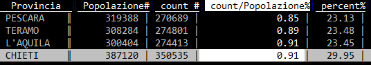

# Fogli

## Introduzione

In VisiData ci sono tre tipi di fogli:

- i **fogli sorgente**, con i dati che si è scelto di aprire con VisiData;
- i [**fogli derivati**](#fogli-derivati), come quelli derivanti da filtraggio o la tabelle con le frequenze (vedi sotto);
- i [**metafogli**](#metafogli), che descrivono e definiscono i dataset caricati (come quello che descrive ad esempio le colonne di una tabella, o il "foglio dei fogli").

Il foglio/tabella correntemente aperto si chiude con `q`.

## Fare JOIN tra tabelle

Se ad esempio si volesse calcolare il rapporto tra numero di mezzi e popolazione, sarebbe utile fare un JOIN con una tabella con i dati della popolazione residente.

I dati per provincia sono quelli di sotto e sono stati salvati in un [file TSV](./dati/popolazioneAbruzzo.tsv) denominato [`popolazioneAbruzzo.tsv`](./dati/popolazioneAbruzzo.tsv) (fonte [ISTAT](http://dati.istat.it/Index.aspx?QueryId=18545#)).

| Provincia | Popolazione |
| --- | --- |
| L'AQUILA | 300404 |
| TERAMO | 308284 |
| PESCARA | 319388 |
| CHIETI | 387120 |

Si può fare in questo modo:

- si parte da `vd parco_circolante_Abruzzo.csv`;
- si va sulla colonna `provincia_residenza`;
- si calcola il foglio delle frequenze pigiando `Shift+f` e si ottiene

- si rinomina questo foglio frequenze premendo la barra spaziatrice, scrivendo il comando `rename-sheet` e dando poi `Invio`. E poi inserendo il nome nuovo (ad esempio `mezziProvincia`);
- si apre la tabella con i dati sulla popolazione per provincia, pigiando `o`, scrivendo `popolazioneAbruzzo.tsv` (che è il nome del file) e pigiando `Invio` (NOTA BENE si può scrivere anche soltanto `popo` e poi pigiare `TAB` e il nome del file verrà autocompletato). Si otterrà

- si va nella colonna `Provincia` e si preme `!` per impostarla come colonna chiave. Il JOIN in VisiData viene fatto tra colonne chiave;
- si apre il "foglio dei fogli" con `Shift+s` e si visualizzerà qualcosa come;

- si va nella riga che contiene lo *sheet* `popolazioneAbruzzo` e si pigia <kbd>INVIO</kbd>;
- si va di nuovo nella colonna `Provincia` e si preme `!` per impostarla come colonna chiave;
- si apre il "foglio dei fogli" con `Shift+s`;
- si selezionano con `s` le due tabelle `mezziProvincia` e `popolazioneAbruzzo`;
- si pigia `&` che è il comando di JOIN e in basso a sinistra ci viene chiesto quale tipo si vuole applicare (**nota bene**: con VisiData >2.0 si deve premere `CTRL + x` e scegliere il tipo di `JOIN`);

- si scrive `inner` e si pigia `Invio` e si ottiene una tabella che contiene sia il numero di mezzi per provincia, che il numero di abitanti.

Da questa tabella a questo punto, semplificando un po', si potrebbe rapidamente calcolare il numero macchine per persona, in questo modo:

- si va nella colonna `Popolazione` e si preme `#` per impostarla come numero intero;
- si pigia `=` (per creare una nuova colonna con valori frutto di un'espressione);
- si scrive poi nel _prompt_ `count/Popolazione` (c'è l'autocompletamento con `TAB` dei nomi delle colonne);
- e si ottiene un risultato come quello di sotto.

## Concatenare tabelle in verticale

La concatenazione in "verticale" tra due o più tabelle con la stessa struttura si attiva tramite `&`. Ad esempio, a partire dai due file `inputFileOne.csv` e `inputFileTwo.csv`, presenti [qui](https://github.com/ondata/guidaVisiData/tree/master/dati) si procede in questo modo:

- si apre la shell e si va nella cartella che contiene i file da concatenare;
- si scrive `vd` e si preme `INVIO`;
- si selezionano con `s` i due file;
- si preme `g INVIO` per aprirli entrambi;
- si apre il foglio dei fogli con `SHIFT+S`;
- si selezionano  `inputFileOne.csv` e `inputFileTwo.csv` con `s`;
- si preme `&` per attivare la concatenazione;
- si preme `CTRL+X` per il menu;
- si seleziona `append` e poi si preme `INVIO`.

Si avrà a video l'unione dei due file di input (in [questo video](http://youtu.be/NJ8FBYI-WGE?hd=1) una replica di quanto descritto, per versioni `vd < 2`).

## Tabelle Pivot

Ecco ad esempio come creare quella che da conto del numero di mezzi per marca, suddivisi per provincia:

- si va nella colonna `marca` e si imposta come colonna chiave, premendo `!`;
- si va poi nella colonna `provincia_residenza` e si pigia `SHIFT+W`;
- si ottiene la tabella pivot desiderata.

Se invece del conteggio delle occorrenze si volesse (a partire da un altro campo) calcolare un altro dato aggregato  - come ad esempio l'età media per marca e provincia - si può procedere in questo modo:

- si va nella colonna `eta_intestatario` e si imposta a numero intero, pigiando su `#`;
- si preme `+`, poi in basso a sinistra nel _prompt_ si scrive `avg` e infine si dà `INVIO`;
si va di nuovo nella colonna `provincia_residenza` e si pigia `SHIFT+W`.

In output, per ogni provincia, si avrà quindi la media desiderata.

## Metafogli

### Foglio di riepilogo globale

Per avere una visione a "volo d'uccello" sull'intera tabella esiste il comando `Shift+i`, che restituisce un riepilogo statistico per tutte le colonne. 
Se prima di lanciarlo si definiscono correttamente i campi (ad esempio i numerici, come numerici), verranno eseguiti correttamente anche i calcoli per `min`, `max`, `median`, `mean`, `stdev`.

Questa è un'altra _feature_ di grande comodità (presente in molte applicazione e ambienti per analisi dati), che verrà usata molto da chi lavorerà con VisiData.

### Foglio dei fogli

Il "foglio dei fogli" si apre con `Shift + s` e fornisce l'elenco (e alcune informazioni correlate) di tutti i fogli aperti. Selezionandone uno e pigiando `Invio`, quest'ultimo si aprirà.

Per rinominarne uno dal "foglio dei fogli", basta selezionarlo, premere `e` e inserire il nuovo nome e poi dare `Invio`. O in alternativa, se si è davanti al foglio che si vuole rinominare, premere la `barra spaziatrice`, scrivere `rename-sheet`, digitare il nuovo nome e infine pigiare su `Invio`.

## Fogli derivati

### Foglio delle frequenze

Uno dei modi per avere un riepilogo è usare il foglio delle frequenze. A partire da una colonna (o dalla combinazione di più d'una) è possibile - con `Shift+f` - aprire un foglio derivato, che contiene dei dati relativi al conteggio per valori distinti di quanto contenuto in quella colonna.

Se per esempio a partire dal Parco Circolante dei veicoli dell'Abruzzo, si volesse avere un'idea sulla distribuzione per "marca", basta navigare in vista tabella sino a quella colonna e poi pigiare `Shift+f` e avere qualcosa come quella di sotto.

I dati sono ordinati per conteggio ed emerge subito come una famosa marca nazionale da sola faccia 1/4 del campione. Così come emerge che c'è un 5% di elementi in cui la marca non è definita e anche questa è un'informazione che ci potrebbe consentire da subito di prendere delle decisioni.  Molto comoda anche la colonna `histogram` che da visivamente in modo molto diretto un'idea del rapporto tra i numeri descritti in tabella.

È possibile generare un foglio delle frequenze anche basato su più colonne. Per farlo si impostano come colonne chiave ([qui](#come-definire-una-colonna-chiave) come fare) quelle che si vogliono trasformare in "foglio delle frequenze", e poi si pigia `g+Shift+f`. Qui sotto ad esempio un riepilogo per le coppie univoche di `destinazione/alimentazione`.

I fogli di frequenza, oltre al conteggio per valori distinti, possono contenere altri calcoli. Gli "aggregatori" possibili sono `min`, `max`, `avg / mean`, `median`, `q3/q4/q5/q10` (terzili/quartili/quintili/decili), `sum`, `distinct`, `count` e `keymax`.

Ad esempio per ogni provincia si può avere restituito la distribuzione di età per quartile e scoprire che il 50% del campione è compreso nella fascia di età tra i 18 e circa i 55 anni.

Per aggiungere l'aggregatore `q4` al foglio delle frequenze, bisogna seguire questi passi:

- navigare sino alla colonna `eta_intestatario` e impostarla a numero intero con `#`;
- premere `+` e scrivere (in basso a sinistra) `q4` (per il calcolo dei quartili, quindi al 25, 50 e 75 percento);
- navigare sino alla colonna `provincia_residenza` e pigiare `Shift+f`.

Inizierà da subito il calcolo (che non è immediato, sono più di un milione di righe) e alla fine si avrà qualcosa come l'immagine di sopra (non è fico VisiData?).

## Salvare un foglio

Per salvare un foglio si preme `CTRL+s`, poi si scrive il nome del file con estensione (`nomeEsempio.csv`) e infine si pigia `Invio`.
