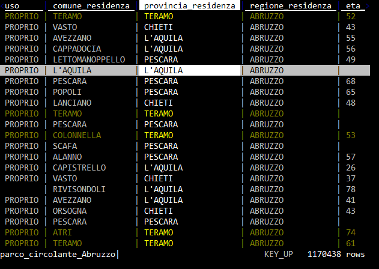
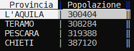

# Lavorare sulle righe

La cosa più importante da comprendere è come selezionarle e deselezionarle, perché molte delle operazioni vengono  eseguite proprio su quelle selezionate.

I tasti principali di selezione sono:

- `s`, per selezionare la riga corrente;
- `u`, per deselezionare la riga corrente;
- `t`, per invertire la selezione della riga corrente;
- `gs`, per selezionare tutte le righe;
- `gu`, per deselezionare tutte le righe;
- `gt`, per invertire i criteri di selezione per tutte le righe.

## Selezione di righe tramite espressione regolare

- `| + termine da ricercare`, seleziona tutte le righe in cui c'è corrispondenza per la colonna corrente;
- `\ + termine da ricercare`, deseleziona tutte le righe in cui c'è corrispondenza per la colonna corrente;
- `g| + termine da ricercare`, seleziona tutte le righe in cui c'è corrispondenza per una qualsiasi colonna;
- `g\ + termine da ricercare`, deseleziona tutte le righe in cui c'è corrispondenza per una qualsiasi colonna;
- `,`, dato il valore della cella selezionata, seleziona tutte le righe in cui per la colonna corrente c'è corrispondenza;
- `g,`, seleziona tutte le righe uguali a quelle corrente.

Ad esempio si apre [questo file](./dati/inputFileOne.csv) con VisiData:

- ci si sposta nella colonna `provincia_residenza`
- poi si pigia `|`;
- si digita `TERAMO`;
- si preme `Invio`.

... si ottiene qualcosa come quella di sotto.

## Selezione di righe tramite espressioni Python

È possibile fare una selezione di righe tramite un'espressione di Python ([qui](https://docs.python.org/3/tutorial/introduction.html) per approfondire sui concetti di base delle espressioni).

I comandi da tastiera sono:

- `z|`, per selezionare tutte le righe in cui l'espressione è valida;
- `z\`, per deselezionare tutte le righe in cui l'espressione è valida.

Ad esempio se voglio selezionare da [questo file](./dati/inputFileOne.csv) tutte le righe relative a donne, la cui provincia di residenza è "Pescara", questi gli step:

- `gu`, per deselezionare tutto;
- `z|`, per attivare la selezione tramite espressione Python;
- scrivendo `provincia_residenza == "PESCARA" and sesso == "F"`;
- e pigiando su `Invio`.

... verranno selezionati tutti gli elementi in cui la provincia è "Pescara" ed il sesso è "F".

## Selezione di righe tramite espressioni Python e regex

- si digita `z|`;
- si scrive l'espressione, come ad esempio `re.search("^1", FieldB) and re.search("^2", FieldA)`, ovvero tutte le righe in cui il campo `FieldB` inizia per `1` e il campo `FieldA` per `2`.

!!! attention "Attenzione"

    Per utilizzare le espressioni regolari all'interno di una *Python expression* bisogna importare il modulo Python `re`. [Qui](./configurazione.md#importare-un-modulo-python) le note per farlo.

## Selezionare un numero random di righe

- aprire una tabella;
- fare click sulla <kbd>barra spaziatrice</kbd> ;
- scrivere `random-rows` (si può scrivere anche soltanto ad esempio `ran` e autocompletare con <kbd>TAB</kbd> ) e premere <kbd>INVIO</kbd> ;
- scrivere il numero di righe random che si vogliono selezionare.

## Spostare righe

Si fa con queste combinazioni:

- `Shift+j`, per spostare la riga corrente verso il basso;
- `Shift+k`, per spostare la riga corrente verso l'alto.

## Cancellare righe

- <kbd>D</kbd> per cancellare la riga corrente;
- <kbd>G</kbd> + <kbd>D</kbd> per cancellare le righe selezionate.

## Modificare il contenuto

Questi i comandi di base:

- `e`, per modificare la cella corrente;
- `Enter`, per chiudere la modifica;
- `Control+c`, per cancellare la modifica;
- `Control+a`, per andare a inizio linea;
- `Control+e`, per andare a fine linea;
- `Control+k`, per cancellare il contenuto a partire dalla posizione del cursore.

---

## Ordinare e filtrare

### Ordinare righe

I tasti `[` e `]` ordinano i dati rispettivamente in modo crescente e decrescente, a partire dalla colonna attiva.

### Filtrare righe

È possibile estrarre in vari modi un campione delle righe della tabella visualizzata. Quello di base è a partire dalla selezione delle righe (in uno dei modi visti sopra) e poi pigiare `"`. Ad esempio si naviga sino alla colonna `marca`, si preme `|`, si scrive `chevr`, si pigia `Invio` (vengono selezionati tutti i record associati a `CHEVROLET`) e infine si preme `"`. Si avrà una tabella filtrata, con gli 8814 record relativi a questa marca per l'Abruzzo.

Oppure posso farlo a partire da un "foglio delle frequenze" (vedi [qui](#il-foglio-delle-frequenze)):

- si naviga sino alla colonna `marca`;
- si pigia `Shift+f`, che mi da in _output_ il conteggio dei valori distinti per marca (sono più di un milione di record, ci vorrà un po' di tempo);
- si scorre sino alla riga che contiene la marca che si vuole filtrare;

- si pigia `Invio` e si avrà una tabella filtrata, con i record relativi a quella marca per l'Abruzzo.

Dal foglio delle frequenze è possibile filtrare su più di un elemento:

- si selezionano ad esempio tre marche, pigiando `s` per ognuna;
- si chiude il foglio delle frequenze con `q` e si torna al foglio dati;
- si pigia `"` e si ottiene una tabella filtrata con i dati relativi alle sole tre marche selezionate prima.

### Filtro tramite espressione Python

È possibile **filtrare** righe tramite un'**`espressione` Python** ([qui](https://docs.python.org/3/reference/expressions.html) la documentazione ufficiale e [qui](https://realpython.com/python-operators-expressions/) una guida che consiglio).
Se ad esempio dalla tabella di sotto si volessero soltanto le province con più di 350.000 abitanti

basterebbe:

- per prima cosa impostare il campo `Popolazione` come numerico, pigiando <kbd>#</kbd>;
- pigiare `z|` per attivare il filtro tramite espressione Python;
- scrivere l'espressione basata sulla colonna, che qui è `Popolazione>350000` e poi premere <kbd>INVIO</kbd>.

In output si avrà la selezione di tutte le righe che risolvono l'espressione scritta.

Note:

- nel filtro per espressione c'è l'autocompletamento del nome colonna, quindi se si scrive ad esempio `Pop` e poi si fa click su <kbd>TAB</kbd>, viene restituito a schermo `Popolazione`;
- è possibile scrivere espressioni complesse, che fanno riferimento a più colonne.

### Filtro tramite espressione Python su campo datetime

È possibile filtrare righe tramite un'espressione Python a partire da campi `datetime`, dopo averli impostare come data.

Usando [questo](https://raw.githubusercontent.com/pcm-dpc/COVID-19/master/dati-andamento-nazionale/dpc-covid19-ita-andamento-nazionale.csv) file CSV (by [PCM-DPC](https://github.com/pcm-dpc/COVID-19)), se ad esempio dalla tabella di sotto si volessero soltanto i record con giorno 29:

basterebbe:

- per prima cosa impostare il campo `data` come data, pigiando <kbd>@</kbd>;
- pigiare `z|` per attivare il filtro tramite espressione Python;
- scrivere l'espressione basata sulla colonna, che qui è `data.day == 29` e poi premere <kbd>INVIO</kbd>.

In output si avrà la selezione di tutte le righe che risolvono l'espressione scritta.

Osservazioni: oltre a `day` è possibile usare: `month`, `year`e `hour`

Se si vogliono ad esempio selezionare soltanto righe con date nel futuro, l'espressione sarà `data > datetime.datetime.now()`.

### Filtri tramite espressione python, basata su più colonne

Si vogliono ad esempio selezionare tutte le righe in cui il domicilio non è né a Palermo, né a Ragusa, ma la cui residenza è in una di queste due città.

A partire ad esempio da:

| domicilio | residenza |
| --- | --- |
| PA | PA |
| RG | RG |
| TO | TO |
| VE | PA |

Questa la procedura:

- pigiare `z|` per selezionare tramite espressione Python;
- scrivere `re.search("^(?!PA|RG).*", domicilio) and re.search("(PA|RG)", residenza)`;
- premere <kbd>INVIO</kbd>.

La prima è una speciale condizione di `regex`, che cerca al negativo.

Sarà selezionata soltanto la riga seguente:

| domicilio | residenza |
| --- | --- |
| VE | PA |

!!! warning "Attenzione"

    Questa espressione sfrutta il modulo `re` di Python, che non è importato *by default* in VisiData. Quindi dovrai aggiungere l'istruzione di `import` nel [file di configurazione](./configurazione.md#importare-un-modulo-python).
