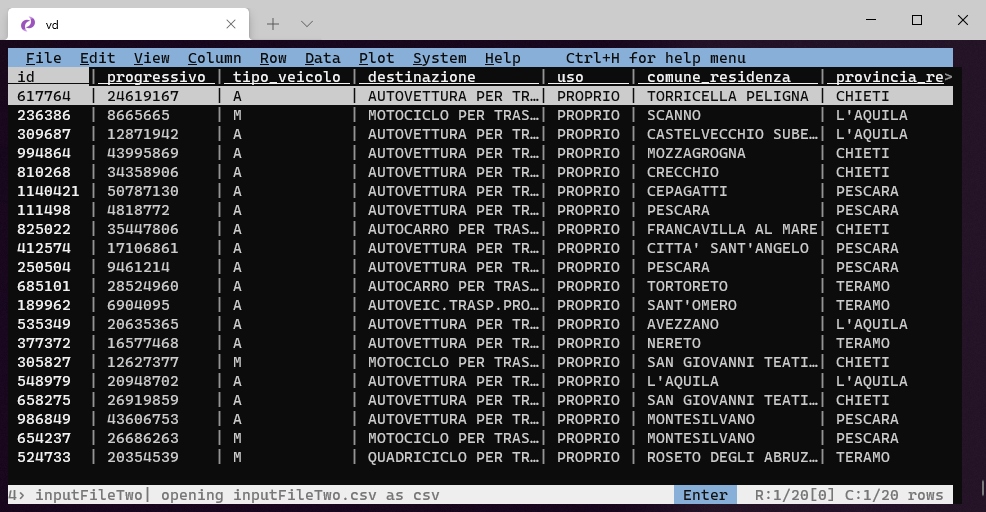

# Primi passi

**VisiData** si utilizza dalla `shell`, quindi il primo passo è aprirla.

## Aprire un file

Il comando di base è:

```bash
vd input.csv
```

Se il file di input è ad esempio questo CSV

```
id,Variable,Value
1,size,55
1,material,wood
2,size,100
2,material,iron
2,shape,round
```

nella `shell` saranno visualizzati i relativi dati contenuti in esso



## Formati file

VisiData supporta [decine di formati](formati.md) di file: tra questi `TSV`,`CSV`,`sqlite`,`JSON`,`XML`,`XLSX`,`html`, ecc.. Il suo **formato** di ***default*** è il **TSV**.

!!! attention "Nota bene"

    Se il file non ha estensione - ad esempio si chiama `input` - e lo apri con `vd input`, VisiData lo interpreterà come un TSV.


L'interpretazione del formato viene fatta in due modi:

- se il file ha l'estensione, viene ricavata da questa;
- oppure si può forzare il formato con un'opzione in apertura. Se si vuole ad esempio che il file sia interpretato come un JSON, il comando sarà `vd -f json input`.
