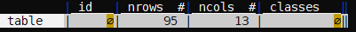
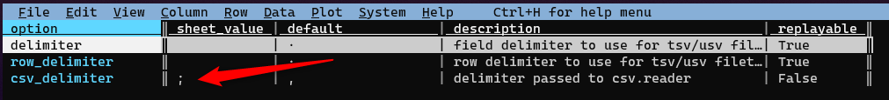

# Ricette

### Filtrare un campo con delle date

Si ha a disposizione un file come quello di sotto, da cui si vogliono estrarre soltanto le righe che contengono date comprese tra i giorni 8 agosto 2020 e 2 maggio 2023. Nota bene, il campo `data` di questo CSV ha una struttura `YYYY-MM-DD`, che consente di usare in modo "nativo" le funzioni Python sulle date.

```
id,data
1,2020-12-05
2,2020-07-08
3,2024-12-05
```

Questi i passi da eseguire:

- si va sulla colonna `data`;
- si imposta per questa il tipo di campo, indicando che è un campo che contiene date, facendo click su `@`;
- si fa click su `z|` per applicare un'espressione Python (vedi sotto);
- si scrive un'espressione coerente con gli obiettivi e si fa *click* su <kbd>INVIO</kbd>.

L'espressione per applicare il filtro descritto sopra è:

```python
data > datetime.date(2020,8,8) and data < datetime.date(2023,5,2)
```

Sarà selezionata soltanto la riga `1,2020-12-05`.

### Salvare una tabella HTML in CSV, a partire da una pagina web

In questo esempio il presupposto è che si voglia trasformare in CSV una tabella HTML presente in una pagina web, in cui ci sono più tabelle. Il punto di partenza è quello di estrarre dalla pagina sorgente, una pagina HTML che contiene soltanto la tabella di interesse.

La pagina di esempio è:<br><https://web.archive.org/web/20190618071304/http://www.sias.regione.sicilia.it/NHEOWLH140_00_1.html>

Questa è composta da diverse tabelle.


Quella di interesse è l'unica composta da più di 7 colonne, e la query XPATH per estrarla è `//table[count(tr/td)>7]`.

La pagina di origine ha l'*encoding* in `ISO-8859-1`, ed è da convertire in `UTF-8`.

Per scaricare la pagina, cambiarne l'*encoding* ed estrarre la tabella di interesse il comando può essere

```bash
curl "http://www.sias.regione.sicilia.it/NHEOWLH140_00_1.html" | \
iconv -f ISO-8859-1 -t utf-8  | \
scrape -be '//table[count(tr/td)>7]'
```

L'*utility* usata sopra per fare la *query* `XPATH` è [scrape-cli](https://github.com/aborruso/scrape-cli).<br>
In output si ha una pagina web che contiene soltanto la tabella di interesse.

Per passarla a VisiData bisognerà modificare così lo script:

```bash
curl "http://www.sias.regione.sicilia.it/NHEOWLH140_00_1.html" | \
iconv -f ISO-8859-1 -t utf-8  | \
scrape -be '//table[count(tr/td)>7]' | \
vd -f html
```

Come risultato si aprirà la finestra di sotto. Per aprire la tabella sarà necessario premere `INVIO` e poi si potrà salvare la tabella in CSV (o altri formati) digitando `CTRL+ s`.



Se si vuole inserire nello script anche la procedura di salvataggio, bisogna modificare lo script in questo modo:

```bash
curl "http://www.sias.regione.sicilia.it/NHEOWLH140_00_1.html" | \
iconv -f ISO-8859-1 -t utf-8  | \
scrape -be '//table[count(tr/td)>7]' | \
vd -b -f html -o out.csv -p dive.vd
```

Note:

- `-b` è per eseguire VisiData senza interfaccia;
- `-p dive.vd` per eseguire dei comandi (qui semplicemente l'apertura della tabella a partire dalla finestra iniziale di sopra).

Nel file [`dive.vd`](./dati/dive.vd) c'è il seguente contenuto.

```
sheet	col	row	longname	input	keystrokes	comment
			open-file	-	o
-		0	dive-row		^J
```


Il file di sopra è un file di log di VisiData (vedi [sezione dedicata](#Salvare-un-flusso-di-lavoro)). Tutte le operazioni fatte in VisiData finiscono in un log che può essere visualizzato e salvato. Quindi è possibile salvare la visualizzazione dell'elenco delle tabelle e poi l'apertura di quella di interesse.

Per creare questo di sopra:

- arrivare a visualizzare la tabella su VisiData;
- digitare `INVIO`;
- digitate `SHIFT + d` per visualizzare il log dei comandi;
- e infine `CTRL + s` per salvare il file `dive.vd`.


### Salvare in blocco tutte le tabelle di una pagina web

Alle volte in una pagina HTML ci sono più tabelle. Ad esempio quelle della pagina sul rapporto "[Ecosistema urbano di Legambiente e Ambiente Italia](https://lab24.ilsole24ore.com/ecosistema-urbano/indexT.php)".

[](https://lab24.ilsole24ore.com/ecosistema-urbano/indexT.php)

Per scaricarle e salvarle tutte, questi i passi da seguire:

- aprire la pagina, specificando con `--save-filetype=csv` quale sarà il formato in cui si vorranno salvare le tabelle;

```
vd https://lab24.ilsole24ore.com/ecosistema-urbano/indexT.php --save-filetype=csv
```

- una volta aperto VisiData, rimanere nelle prima colonna e selezionare tutto con `gs`;
- la prima colonna contiene il nome delle tabelle. In questo caso sono una ventina e hanno tutte lo stesso nome. Per poterle salvare, senza sovrascriversi a vicenda (hanno tutte lo stesso nome), rinominarle con `gi` che creerà in quella colonna - per ogni cella - un progressivo numerico a partire da `1`;


- lanciare il comando per salvare tutte le tabelle (che sono già selezionate), ovvero `g+CTRL+s`;
- indicare come output la cartella corrente `./` (occhio quindi, verificare che non ci sia nulla di importante dentro) e dare INVIO;
- verrà chiesto il permesso di sovrascrivere; rispondere con `yes`.

Nella cartella di lavoro saranno disponibili tutte le tabelle, in formato `CSV`.

Nota bene: la ricetta è stata stimolata da [questa domanda](https://github.com/ondata/guidaVisiData/discussions/26#discussion-3676008).

### Salvare un flusso di lavoro

#### Introduzione

In **VisiData** è possibile salvare il [log delle operazione fatte](https://www.visidata.org/docs/save-restore/) e riutilizzarlo per applicarle nuovamente al file di input.

Se ad esempio a partire da [questo file `CSV`](risorse/input.csv) (sotto l'anteprima) si volessero cancellare tutte le righe che contengono il solo carattere `a` nella prima colonna e infine salvare l'*output*, la procedura è:

- `vd input.csv`;
- posizionarsi nella prima colonna e pigiare <kbd>|</kbd> per attivare la selezione tramite espressione regolare, scrivere `^a$` e premere <kbd>INVIO</kbd>. Verrà fatta la selezione descritta;
- pigiare in sequenza <kbd>g</kbd> e <kbd>d</kbd> per cancellare le righe selezionate;
- poi <kbd>CTRL+s</kbd>;
- e infine scegliere un nome di output (ad esempio `output.csv`) e pigiare <kbd>INVIO</kbd> per salvare il file.

| field1 | field2 |
| --- | --- |
| a | 0 |
| b | 3 |
| a | 4 |
| c | 5 |

Per salvare la procedura di sopra in un file di log, bisognerà premere <kbd>CTRL+d</kbd>, scegliere un nome per salvare il file (ad esempio `cancella_le_a.vd`) e pigiare <kbd>INVIO</kbd>.

Il file di log salvato avrà un contenuto come quello sottostante ([è un file `TSV`](#nota-sul-file-di-log)), in cui sono "mappate" tutte le operazioni fatte:


| sheet | col | row | longname | input | keystrokes | comment |
| --- | --- | --- | --- | --- | --- | --- |
| global |  | null_value | set-option |  |  |  |
|  |  |  | open-file | input.csv | o |  |
| input | field1 |  | select-col-regex | ^a$ | | | select rows matching regex in current column |
| input |  |  | delete-selected |  | gd | delete (cut) selected rows and move them to clipboard |
| input |  |  | save-sheet | output.csv | ^S | save current sheet to filename in format determined by extension (default .tsv) |


Per riapplicare la stessa procedura al file, senza interagire con lo schermo, il comando da lanciare è:

```
vd -b -p cancella_le_a.vd
```

- `-b` per eseguire VisiData senza attivarne l'interfaccia;
- `-p` per replicare un file di log.

Se questo comando si lancia dopo avere già creato il file di *output*, si avrà un messaggio di errore, che avvisa che il file esiste già e non può essere sovrascritto.<br>
Per fare in modo che venga sovrascritto bisognerà aggiungere l'opzione `-y`:

```
vd -y -b -p cancella_le_a.vd
```

A schermo verrà restituito l'elenco delle operazione svolte:

```
opening cancella_le_a.vd as vd
"input.csv"
opening input.csv as csv
select rows matching regex in current column
"^a$"
search wrapped
2 matches for /^a$/
selected 2 rows
delete (cut) selected rows and move them to clipboard
copied 2 rows to clipboard
deleted 2 rows
save current sheet to filename in format determined by extension (default .tsv)
"output.csv"
saving 1 sheets to output.csv as csv
replay complete
```


#### Applicare lo stesso flusso a un file diverso, ma omologo

Spesso si ha la necessità di **applicare una stessa procedura ad altri file**, con la **stessa struttura**, ma con **contenuti differenti**.<br>
Per utilizzare il file di log creato con un file diverso da `input.csv`, bisognerà modificare il file di log (si modifica con qualsiasi editor di testo):

- rimuovere la riga con il riferimento a `input.csv`
- rimuovere il riferimento al nome del foglio (qui è `input`, come il nome del file).

Diventerà quindi:


| sheet | col | row | longname | input | keystrokes | comment |
| --- | --- | --- | --- | --- | --- | --- |
| global |  | null_value | set-option |  |  |  |
|  | field1 |  | select-col-regex | ^a$ | | | select rows matching regex in current column |
|  |  |  | delete-selected |  | gd | delete (cut) selected rows and move them to clipboard |
|  |  |  | save-sheet | output.csv | ^S | save current sheet to filename in format determined by extension (default .tsv) |


Fatto questo, il comando da usare con un nuovo file denominato ad esempio `input_nuovo.csv` sarà:

```
vd -y -b -p cancella_le_a.vd input_nuovo.csv
```

In output verrà creato il file `output.csv`.

Se si vuole creare un file di output con nome diverso, si deve cancellare dal file di log la riga in cui si fa riferimento a `output.csv` e lanciare il comando:

```
vd -y -b -p cancella_le_a.vd input_nuovo.csv -o output_nuovo.csv
```


#### Nota sul file di log

Si tratta di un TSV, quindi **è possibile leggerlo e modificarlo proprio con VisiData**:


### Fare il redirect dell'output verso lo stdout

Il comando

```
vd input.csv -b --save-filetype json | jq .
```

invierà ad esempio a `jq` un *output* `JSON` a partire dal CSV di *input*.

Se ad esempio si vuole passare l'output a grep:

```
vd input.csv -b --save-filetype tsv 2> /dev/null | grep 'a'
```

`2> /dev/null` per non avere `stderr` a schermo.

### Creare un grafico di dispersione (scatter plot)

VisiData può stampare a schermo anche dei grafici XY. Non è un suo punto di forza, ma può essere utile per avere una prima e grezza visualizzazione spaziale dell'insieme dei dati.

Il requisito per crearne uno, è avere due colonne numeriche, da usare come coppia di coordinate. Qualcosa come quella di sotto.

| fid | X | Y |
| --- | --- | --- |
| 1 | 12.29 | 43.76 |
| 2 | 12.16 | 43.64 |
| 3 | 12.15 | 43.65 |
| 4 | 12.16 | 43.63 |
| ... | ... | ... |

Per generare il grafico basterà seguire i seguenti passi:

- impostare come numeriche (numeri decimali digitando `%` sulla colonna, o `#` per numeri interi) le due colonne con le coordinate;
- impostare come colonna chiave la colonna con le ascisse, selezionandola e digitando `!`;
- selezionare la colonna con le ordinate e digitare `.`.

In output si avrà qualcosa come quella di sotto


### Applicare il natural sorting ai contenuti di una cella

Il *natural sorting* è un ordinamento di stringhe più "umano".<br>Se una cella contiene ad esempio i valori `3,1,10,1/A,100,SNC`, l'ordinamento naturale potrebbe essere `1,1/A,3,10,100,SNC`. Di contro un'applicazione - con una lista fatta sia di stringhe che di numeri - produce di solito questo ordinamento `1,1/A,10,100,3,SNC`.

Il *natural sorting* è un concetto noto da tempo in letteratura (un [esempio per tutti](https://www.gnu.org/software/coreutils/manual/coreutils.html#Version-sort-ordering)), ma spesso non è disponibile nativamente e bisogna implementarlo importando librerie o sfruttando funzioni dedicate.

In VisiData è applicabile ad esempio aggiungendo per prima cosa una funzione personalizzata al [file di configurazione](configurazione.md):

``` py
import re

_nsre = re.compile('([0-9]+)')
def natural_sort_key(s):
    return [int(text) if text.isdigit() else text.lower()
            for text in re.split(_nsre, s)]

def natsort(value, delimiter=','):
   list1 = value.split(delimiter)
   list1.sort(key=natural_sort_key)
   joined_string = delimiter.join(list1)
   return joined_string
```

Immaginiamo di volere applicare il *natural sorting* a un file come questo (un `CSV`):

```
nomeCampo
"3,1,10,1/A,100,SNC"
```


Questi saranno i passi da fare:

- aprire il file `vd input.csv`;
- fare click su <kbd>=</kbd>, per creare una nuova colonna basata su un'espressione Python;
- scrivere `natsort(nomeCampo)` e dare <kbd>INVIO</kbd>, per applicare la funzione soprastante, al campo `nomeCampo`.

In *output* si avrà:

```
nomeCampo,natsort(nomeCampo)
"3,1,10,1/A,100,SNC","1,1/A,3,10,100,SNC"
```

Nel [file di configurazione di esempio](configurazione.md#un-file-di-configurazione-di-esempio) inserito in questa guida, è stata aggiunta la funzione `natsort`.<br>
Se nella cella il separatore non è la `,`, si può personalizzare la funzione in questo modo: `natsort(nomeCampo, delimiter='/')` (in questo caso si è impostato come delimitatore il carattere `/`).

Grazie a [Salvatore Fiandaca](https://twitter.com/totofiandaca), per averci stimolato ad approfondire la cosa, con [questa domanda](https://gis.stackexchange.com/questions/421166/sorting-alphanumeric-array-numerically-using-qgis-field-calculator) su StackExchange.

### Cambiare il separatore di campo di un CSV

Se si vuole cambiare il separatore di campo di un CSV, questi i passi da seguire:

- aprire il file;
- fare click su `barra spaziatrice`;
- digitare `options-sheet` e premere `INVIO`, per visualizzare le opzioni del foglio;
- cercare l'opzione `csv_delimiter` e impostare come `sheet_value` il separatore desiderato (la cella si modifica con il tasto `e`);
- chiudere l'`options-sheet` con il tasto `q`;
- premere `CTRL` + `s` e salvare il file in formato `CSV`.


<figure markdown>
  
</figure>

!!! note "Nota"

    Ricetta creata grazie a [questa richiesta](https://github.com/ondata/guidaVisiData/discussions/55) di Salvatore Fiandaca.
